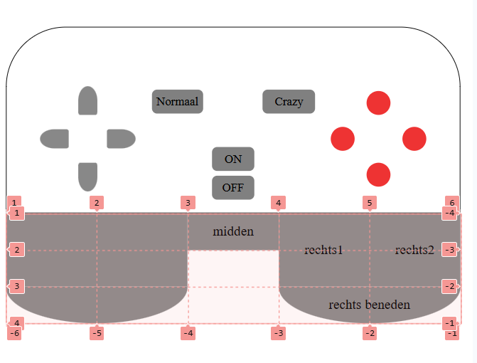

# CSS-to-the-rescue

### Daily check out 18/02/2026
Wat heb ik vandaag gedaan? 
ik heb vandaag gelezen over anchoring, maar ik heb me meer verdiep in summary en details, dus hoe dat precies werkt. Daarna ben ik aan de slag gegaan om mijn kennis toetepassen in een website, en die werkend te maken.

Hoeveel tijd heeft me dat gekost? Het heeft me ongveer 1 uur gekost om in te lezen, en voor het maken van me website ongeveer 3-4 uren.

Wat heb ik vandaag geleerd ?
Ik heb geleerd hoe ik beter kan werken met details and summary. En dat een detail onder elkaar komt aan de hand van de naam en niet de DOM volgorde.  Daarnaast heb ik geleerd hoe ik de details beter kan stylen. Verder heb ik geleerd hoe ik de I> weg kan halen bij de Safari en Microsoft.

Wat ga ik morgen doen? Morgen ga ik me website presenteren en beginnen aan css eindopdracht.

bronnen;

### Daily check out 19/02/2026
Wat heb ik vandaag gedaan? 
ik heb vandaag geleerd hoe ik meer met css kan doen dan voorheen. Dus dit heb ik meegehad met de presentatie. Verder heb ik ook vandaag gepresenteerd over anchoring waaronder mijn stukje over details en summary. ook ben ik gestart met me eindopdracht.

Hoeveel tijd heeft me dat gekost? Het heeft me ongveer 15-20 min geduurd om te presenteren. En de presenatie volgen duurde ongeveer 1.3 uren. 

Wat heb ik geleerd? ik heb geleerd hoe carousel via css alleen kan gebruiken, ook hoe ik :has kan gebruiken, en de scroll animatie vond ik heel leuk hoe die werkt en hoe het simpel is gemaakt met css.

Wat ga ik morgen doen? Morgen ga ik me voortgang bespreken met de docent tijdens de weekly meeting.

bronnen;

### Daily check out 04/03/2026
Wat heb ik vandaag gedaan? 
ik heb vandaag de weekly geek gevolgd van .... Daarna ben ik aan de slag gegaan met mijn website. Ik heb de HTML geschreven en de css een begin gemaakt.

Hoeveel tijd heeft me dat gekost? Het heeft me ongveer 1 uurtje gekost om de weekly geek te volgen. Daarna ongeveer 3-4 uren aan mijn eigen werk

Wat heb ik geleerd? ik heb geleerd hoe ik een aantal images kan gebruiken om een video achtig achtergrond te laten werken.

Wat ga ik morgen doen? Morgen ga ik me css meer stijlen en me controller afmaken.

bronnen;

### weekly Nerd 3
Weekly nerd  04/03/2026

- Vroeger gebruikte mensen Photoshop om websites te maken, nu gebruiken mensen figma.
- Figma gebruikt termen die makkelijker zijn voor de code groep zodat ze die makkelijker kunnen implementeren in de website. 
- Figma helpt ons om websites te maken, met Photoshop kon je niet alles maken in de web maar met figma wel. Dus alles in figma gemaakt kan worden gecodeerd. 

- Ipv video kan je aantal foto’s naast elkaar zetten en dan met animation erop zetten 

- View transitions is een nieuwe CSS ding. Het switch’s van Pages bijvoorbeeld als je de taal wil verwisselen.

### Daily check out 05/03/2026
Wat heb ik vandaag gedaan? 
ik heb vandaag de workshop gevolgd van @properties. Ik heb daar gevolgd hoe ik me kleuren goed kan animeren. Daarna heb ik me controller proberen af te krijgen. Ik heb nu dit. 

Hoeveel tijd heeft me dat gekost? Het heeft me ongveer 1 uurtje gekost om de workshop te volgen. Daarna heb ik ongeveer 3-4 uren aan mijn werk besteedt.

Wat heb ik geleerd? ik heb geleerd hoe ik met properties kan werken. En hoe ik de kleuren dus goed kan laten switchen, want normaliter gebruik je animation, maar nu niet.

Wat ga ik morgen doen? Morgen ga ik me css meer stijlen en me controller afmaken.en me voortgang gesprek voeren.

bronnen;
