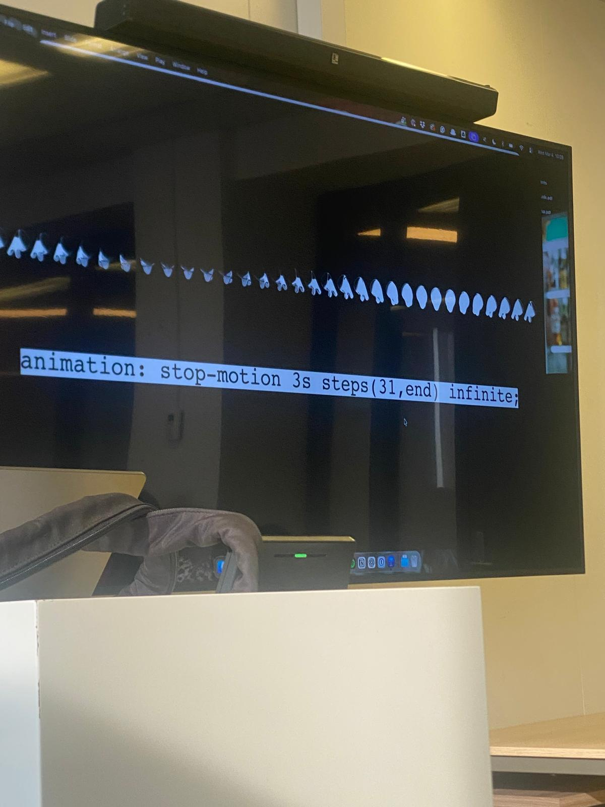
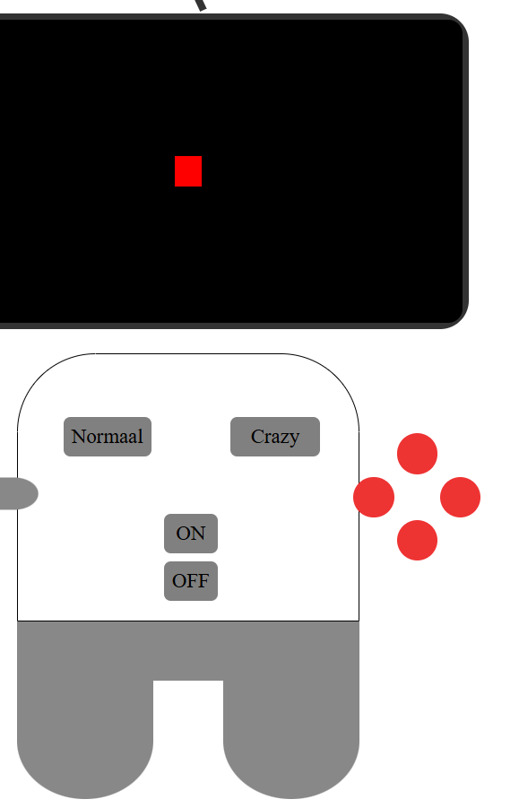
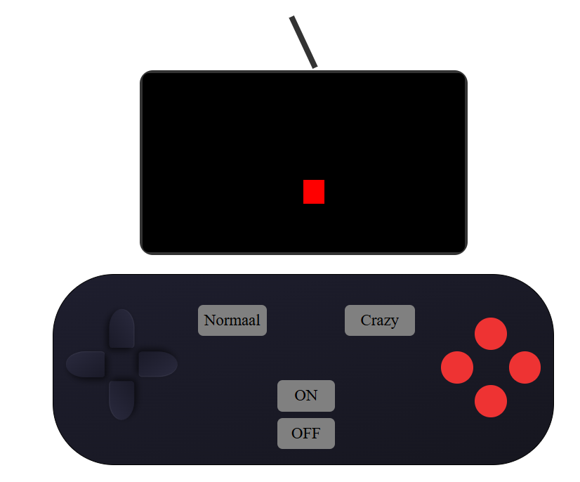
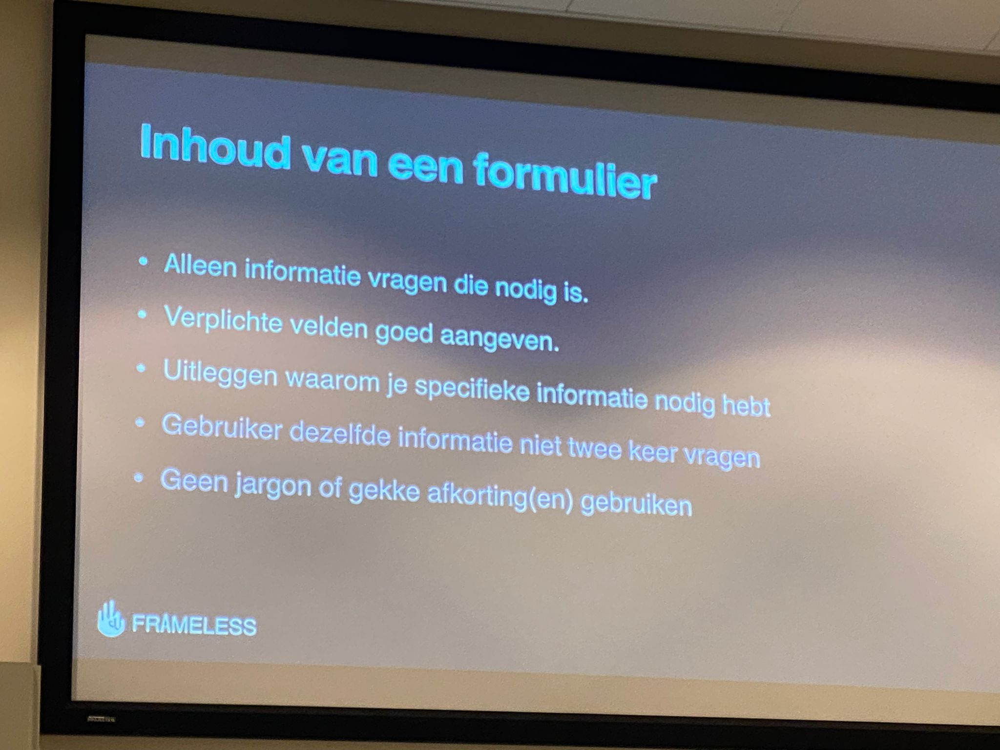
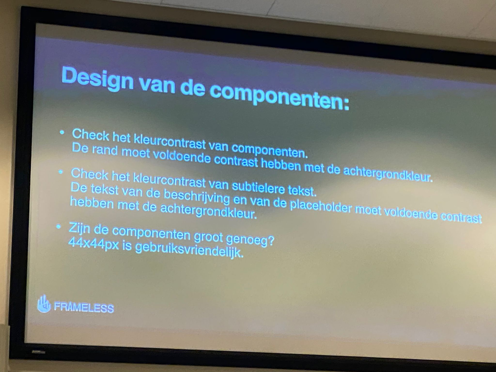
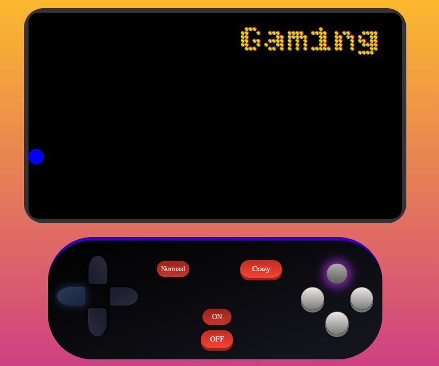

# CSS-to-the-rescue

### Daily check out 18/02/2026
Wat heb ik vandaag gedaan? 
ik heb vandaag gelezen over anchoring, maar ik heb me meer verdiep in summary en details, dus hoe dat precies werkt. Daarna ben ik aan de slag gegaan om mijn kennis toetepassen in een website, en die werkend te maken.

Hoeveel tijd heeft me dat gekost? Het heeft me ongveer 1 uur gekost om in te lezen, en voor het maken van me website ongeveer 3-4 uren.

Wat heb ik vandaag geleerd ?
Ik heb geleerd hoe ik beter kan werken met details and summary. En dat een detail onder elkaar komt aan de hand van de naam en niet de DOM volgorde.  Daarnaast heb ik geleerd hoe ik de details beter kan stylen. Verder heb ik geleerd hoe ik de I> weg kan halen bij de Safari en Microsoft.

Wat ga ik morgen doen? Morgen ga ik me website presenteren en beginnen aan css eindopdracht.

bronnen;

### Daily check out 19/02/2026
Wat heb ik vandaag gedaan? 
ik heb vandaag geleerd hoe ik meer met css kan doen dan voorheen. Dus dit heb ik meegehad met de presentatie. Verder heb ik ook vandaag gepresenteerd over anchoring waaronder mijn stukje over details en summary. ook ben ik gestart met me eindopdracht.

Hoeveel tijd heeft me dat gekost? Het heeft me ongveer 15-20 min geduurd om te presenteren. En de presenatie volgen duurde ongeveer 1.3 uren. 

Wat heb ik geleerd? ik heb geleerd hoe carousel via css alleen kan gebruiken, ook hoe ik :has kan gebruiken, en de scroll animatie vond ik heel leuk hoe die werkt en hoe het simpel is gemaakt met css.

Wat ga ik morgen doen? Morgen ga ik me voortgang bespreken met de docent tijdens de weekly meeting.

bronnen;


### weekly Nerd Peter Paul Koch
Java script word gebruikt als standaard engine. 

AOM is bijna hetzelfde als DOM. Maar beetje anders. Die aom is beter voor mensen met accesibility bijvoorbeeld .

Wat is een browser ? 
-html
-css
- Dom  
- ⁠AOM
- ⁠INTERFACE

Bedenk eerst je lay-out goed. En dan maak het. En veranderd verder niets eraan. Anders gebeurt de popcorn effect en word het een groot probleem

Rendering engine is verantwoordelijk voor html en css parsing en rendering, constructie van de dom en aom trees. Dus niet interface of JavaScript engine.

Backward compatibility:
Alles wat een browser ooit heeft ondersteund moet de browse er voor altijd blijven ondersteunen


## Weekly checkout week 1 (18 - 19 februari 2026)

**Wat heb ik deze week gedaan?**
ik heb deze week me verdiept in details en summary en hoe dat precies werkt. daarna heb ik mijn kennis toegepast in een website en die werkend gemaakt. ook heb ik gepresenteerd over anchoring waaronder mijn stukje over details en summary. verder ben ik gestart met mijn eindopdracht.

**Hoeveel tijd heeft me dat gekost?**
het heeft me ongeveer 7-8 uur gekost. 1 uur inlezen, 3-4 uur aan de website, 15-20 min presenteren en 1.5 uur de presentaties volgen.

**Wat heb ik geleerd?**
ik heb geleerd hoe ik beter kan werken met details en summary, en dat een detail onder elkaar komt aan de hand van de naam en niet de DOM volgorde. ook heb ik geleerd hoe ik het i> icoontje weg kan halen bij Safari en Microsoft. daarnaast heb ik geleerd hoe een carousel via alleen css kan werken, hoe je :has kan gebruiken en hoe scroll animatie simpel te maken is met css.

**bronnen**
- https://developer.chrome.com/docs/css-ui/exclusive-accordion
- https://www.youtube.com/watch?si=8OaVOtHtFTNseJrA&v=Vzj3jSUbMtI&feature=youtu.be
- https://developer.chrome.com/docs/css-ui/animate-to-height-auto
- https://developer.chrome.com/blog/styling-details

### Daily check out 04/03/2026
Wat heb ik vandaag gedaan? 
ik heb vandaag de weekly geek gevolgd van .... Daarna ben ik aan de slag gegaan met mijn website. Ik heb de HTML geschreven en de css een begin gemaakt.

Hoeveel tijd heeft me dat gekost? Het heeft me ongveer 1 uurtje gekost om de weekly geek te volgen. Daarna ongeveer 3-4 uren aan mijn eigen werk

Wat heb ik geleerd? ik heb geleerd hoe ik een aantal images kan gebruiken om een video achtig achtergrond te laten werken.

Wat ga ik morgen doen? Morgen ga ik me css meer stijlen en me controller afmaken.

bronnen;

### weekly Nerd 
Weekly nerd  04/03/2026

- Vroeger gebruikte mensen Photoshop om websites te maken, nu gebruiken mensen figma.
- Figma gebruikt termen die makkelijker zijn voor de code groep zodat ze die makkelijker kunnen implementeren in de website. 
- Figma helpt ons om websites te maken, met Photoshop kon je niet alles maken in de web maar met figma wel. Dus alles in figma gemaakt kan worden gecodeerd. 


- Ipv video kan je aantal foto’s naast elkaar zetten en dan met animation erop zetten 


- View transitions is een nieuwe CSS ding. Het switch’s van Pages bijvoorbeeld als je de taal wil verwisselen.

### Daily check out 05/03/2026
Wat heb ik vandaag gedaan? 
ik heb vandaag de workshop gevolgd van @properties. Ik heb daar gevolgd hoe ik me kleuren goed kan animeren. Daarna heb ik me controller proberen af te krijgen. Ik heb nu dit. 

Hoeveel tijd heeft me dat gekost? Het heeft me ongveer 1 uurtje gekost om de workshop te volgen. Daarna heb ik ongeveer 3-4 uren aan mijn werk besteedt.

Wat heb ik geleerd? ik heb geleerd hoe ik met properties kan werken. En hoe ik de kleuren dus goed kan laten switchen, want normaliter gebruik je animation, maar nu niet.

Wat ga ik morgen doen? Morgen ga ik me css meer stijlen en me controller afmaken.en me voortgang gesprek voeren.

bronnen;

## Weekly checkout week 2 (4 - 5 maart 2026)

**Wat heb ik deze week gedaan?**
ik heb deze week de weekly geek gevolgd en daarna de html geschreven en een begin gemaakt met de css van mijn eindopdracht. ook heb ik de workshop gevolgd over @properties en mijn controller verder uitgewerkt.

**Hoeveel tijd heeft me dat gekost?**
het heeft me ongeveer 9-10 uur gekost. 1 uur weekly geek, 1 uur workshop, de rest aan mijn eigen werk.

**Wat heb ik geleerd?**
ik heb geleerd hoe ik een aantal images naast elkaar kan zetten en daar een animatie op kan zetten zodat het een soort video achtige achtergrond geeft. ook heb ik geleerd hoe ik met @properties kan werken zodat kleuren goed kunnen switchen zonder dat je animation nodig hebt.

**bronnen**
- geen bronnen deze week

### Daily check out 11/03/2026
Wat heb ik vandaag gedaan? 
ik heb vandaag mijn tv gezet in de html en css en een beetje syijl gegeven. Daarna heb ik de knoppen aan de linkerkant laten werken. Maar ik heb het niet goed genoeg laten werken. Ik heb ook een tijdje gezeten aan de responsive van me controller, Dus als het groot scherm is wil ik dat het een beetje kleiner eruit ziet maar het komt uit de scherm dus ik moet dat nog afmaken.



Hoeveel tijd heeft me dat gekost? Het heeft me ongveer 2-3 uurtjes gekost. 

Wat heb ik geleerd? ik heb geleerd hoe ik met pde radiobuttons het blokje kan laten bewegen

Wat ga ik morgen doen? Morgen ga ik me animatie goed laten werken en de knoppen beter stijl geven.

bronnen;

### Daily check out 12/03/2026
Wat heb ik vandaag gedaan? 
ik heb vandaag de workshop ghevolgd voor typografie, en daarna ben ik aan de slag gegaan met mijn eigen werk. Ik zat heel lang aan mijn knoppeb, dus om ze te laten werken, want mijn vierkantje ging bewegen vanuit de start punt en vanuit die punt bewegen. Maar ik wil dat het vanaf de punt moest bewegen van waar hij zich op het moment bevind. En ik heb dit aan sanne gevraagd maar hij kon me niet meteen helpen dus ben ik verder gegaan met stijlen en responsive maken van me website. Ook heb ik me controller aangepast en de onder gedeelte weggehaald want ik vind dat hij er niet zo mooi uit ziet.



Hoeveel tijd heeft me dat gekost? Het heeft me ongveer 4 uurtjes gekost. 

Wat heb ik geleerd? ik heb geleerd hoe je met wiskunde dingen in css kan laten animeren etc, heel byzonder en tof.

Wat ga ik morgen doen? Morgen ga ik me knoppen laten werken mbv Sanne en de stijl beter maken.

bronnen;

## Weekly checkout week 3 (11 - 12 maart 2026)

**Wat heb ik deze week gedaan?**
ik heb deze week mijn tv in html en css gezet en wat stijl gegeven. ook heb ik de knoppen aan de linkerkant laten werken, maar dat werkte nog niet goed genoeg. daarna heb ik de workshop gevolgd over typografie en ben ik verder gegaan met stijlen en responsive maken. ik zat heel lang aan mijn knoppen want het vierkantje bewoog vanuit het startpunt, maar ik wil dat het beweegt vanaf de punt waar het zich op dat moment bevindt. dat heb ik aan sanne gevraagd maar hij kon me niet meteen helpen dus ben ik verder gegaan.

**Hoeveel tijd heeft me dat gekost?**
het heeft me ongeveer 7 uur gekost. 1 uur workshop, de rest aan mijn eigen werk.

**Wat heb ik geleerd?**
ik heb geleerd hoe ik met radiobuttons een blokje kan laten bewegen. ook heb ik geleerd hoe je met wiskunde dingen in css kan laten animeren, heel bijzonder en tof.

**bronnen**
- geen bronnen deze week

### weekly Nerd 

Goed formulier heeft:
- een intro text zodat mensen weten waarover het pagina t heeft 
- ⁠ook dat de formulier alle antwoorden bewaard zodat mensen rekey kunnen komen en invullen als ze op een ander dag afwillen maken.
- ⁠aangeven hoeveel stappen er zijn zodat mensen weten waar ze zijn 
- ⁠linkerkant uitlijnen zodat mensen het begin makkelijk kunnn vinden. 
- ⁠mensne gegevens niet vragen die je niet nodig heb. 
- ⁠een opsomming geven als er een foutmelding komt bijvoorbeeld “ nul naam in” en “ vul straat in” etc.
- handig om mensne het formulier laten uit printen want ze vinden het handiger uit onderzoek




Design van het formulier
• Staan er buttons aan het eind van de regel, zoals "Volgende"?
Plaats de buttons aan het begin van de regel, waar iedereen ze kan vinden.
• De voortgang wordt getoond boven het formulier in tekst, bijvoorbeeld "Stap 2 van 4".
• De navigatie (volgende, vorige, annuleren) is consistent in elke stap.
• Het is duidelijk in welke stap het formulier daadwerkelijk wordt verzonden.
• Elk invoerveld heeft een zichtbaar label dat boven het invoerveld staat.
Alleen bij de zoekfunctie is de label eventueel vervangen door alleen een placeholder.
• Er staat 'verplicht' of 'niet verplicht' in tekst, niet alleen met een sterretje (asterisk*) of kleur.

Sta spaties toe bij plekken zoals postcode en doe met JavaScript dat het goed in de database komt

## Weekly checkout week 4 (18 - 19 maart 2026)

**Wat heb ik deze week gedaan?**
ik heb deze week mijn controller stijl gegeven, met kleuren en box shadows etc. Daarna heb ik de radiobuttons goed laten werken, dus nu kan je een balletje bedienen met de knoppen. En ik met de acie knoppen kan je de knoppen veranderen etc. Ik heb vervolgens de themas in me website gezet met @container. En ik heb alle laatste loodjes aangepast en goed werkend gemaakt. Ook heb ik de font in me website gezet en laten lopen van rechts naar links.

**Hoeveel tijd heeft me dat gekost?**
het heeft me ongeveer 15 uur gekost. bijna volledig aan mijn eigen werk.

**Wat heb ik geleerd?**
ik heb geleerd hoe ik met radiobuttons een blokje kan laten bewegen met property en transition, ook hoe ik echt goed kan werken met @container voor de themas.

**bronnen**
- gradient gemaakt met bron; https://cssgradient.io/
- bron; https://css-tricks.com/color-mixing-with-animation-composition/ 
- Bron: Jacco heeft mij de code toegestuurd en de website vanwaar ik het kon halen https://mtdvlpr.github.io/CSSttR-assignment/ en https://codepen.io/Jacco01/pen/GgjNOqr?editors=1100
- voorbeeld gehaald van https://codepen.io/crossdjinn/pen/PdeJbM 
- bron met ai; prompt: 'wat kan ik gebruiken om de tekst binnen de box the houden'
- bron met ai; prompt "hoe kan ik de tv uit laten zijn wanneer de website load"


## Reflectie

**over het proces**

Wat goed ging is dat ik de controller makkelijk kon stylen. Maar wat ook goed ging is het toepassen van nieuwe technieken in me code zoals de nesting binnen css en de container queries, om het te gebruiken voor de themas. Aan het begin was het wel lastig maar nu dat ik het heb gebruik weet ik het beter toe te passen.
wat ging er niet goed en wat heb je daarvan geleerd? Wat minder goed ging was het gebruiken van de nieuwe code @property, want ik wou het balletje in me scherm laten bewegen maar het lukte niet. En nu wel, want ik heb geleerd hoe ik het kan gebruiken met;
``` css

@property --x {
    syntax: "<number>";
    inherits: true;
    initial-value: 0.5;
}

@property --y {
    syntax: "<number>";
    inherits: true;
    initial-value: 0.5;
}

transition: --x 10000s linear, --y 10000s linear;

    &:has(input[value="omhoog"]:checked) {
        --y: 0;
    }

    &:has(input[value="omlaag"]:checked) {
        --y: 1;
    }

    &:has(input[value="rechts"]:checked) {
        --x: 1;
    }

    &:has(input[value="links"]:checked) {
        --x: 0;
    }

    &:has(input[value="omhoog"]:checked),
    &:has(input[value="omlaag"]:checked) {
        transition: --x 10000s linear, --y 1.5s linear;
    }

    &:has(input[value="rechts"]:checked),
    &:has(input[value="links"]:checked) {
        transition: --x 1.5s linear, --y 10000s linear;
    }


```
Wat ik volgende keer beter zou doen is het zoveel mogelijk gebruik maken van nieuwe code, zodat ik het beter en sneller kan leren.


**over je leerdoelen**

Ik wou meer leren over javascript en css animaties. En ik vind dat ik het stukje over css animaties beter heb geleerd. Niet 100% goed maar wel beter dan toen. Ik weet wat ik moet gebruiken om iets te laten animeren en hoe.

**over de code**

op welk stukje code ben je het meest trots en waarom? Ik ben het meest trots op de code over het balletje, dus dat ik het kan laten bewegen met knoppen en geen javascript. Ook dat het balletje kan veranderen met de knoppen aan de rechterkant. Uiteindelijk vind ik de crazy thema heel leuk en tof hpoe alles zo een beetje veranderd met de container queries. Wat ik minder goed aan me code vind is de structuur en de comments. Ik kan meer comments gebruiken zodat iemand die de code leest het makkelijker kan snappen en begrijpen en vinden waar ze zich bevinden.

**Eind resultaat**


